# Web-Based Food Ordering System
The MyFoodWeyh Web-Based Food Ordering System is a web application developed using HTML, CSS, JavaScript, PHP, and MySQL.

 

## Features
* Login authentication
* Manage user account
* Manage food menu
* Manage order
* Password reset
* Categorized food menus
* Shopping cart & payment
* Delivery status & action

 

## Screenshots
### Admin
#### Login
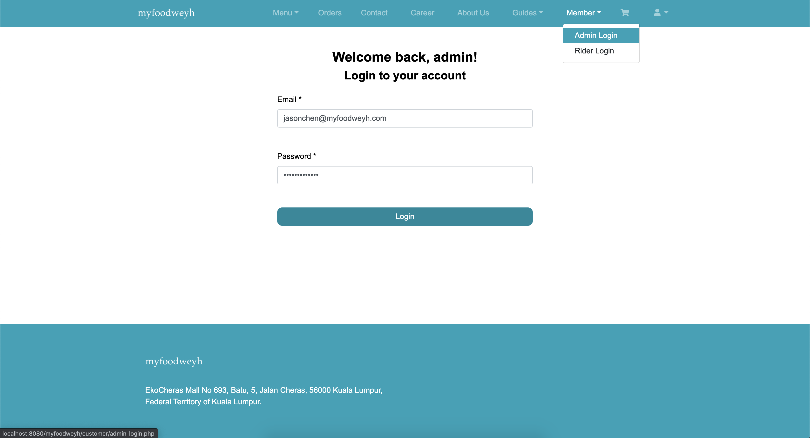

#### Dashboard
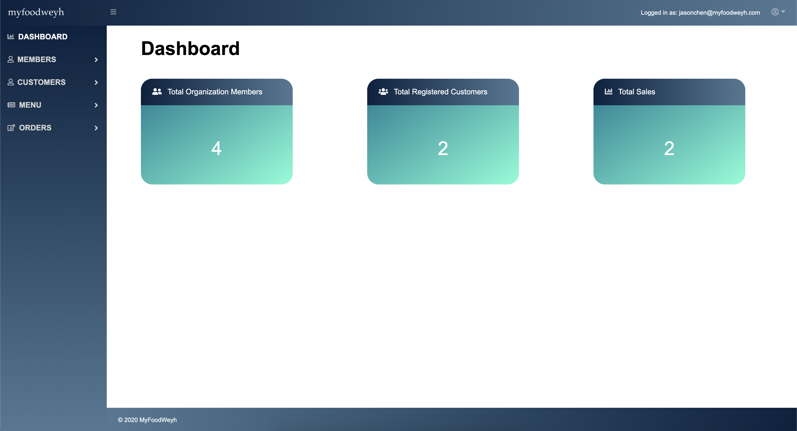

#### Manage Organization Member Account
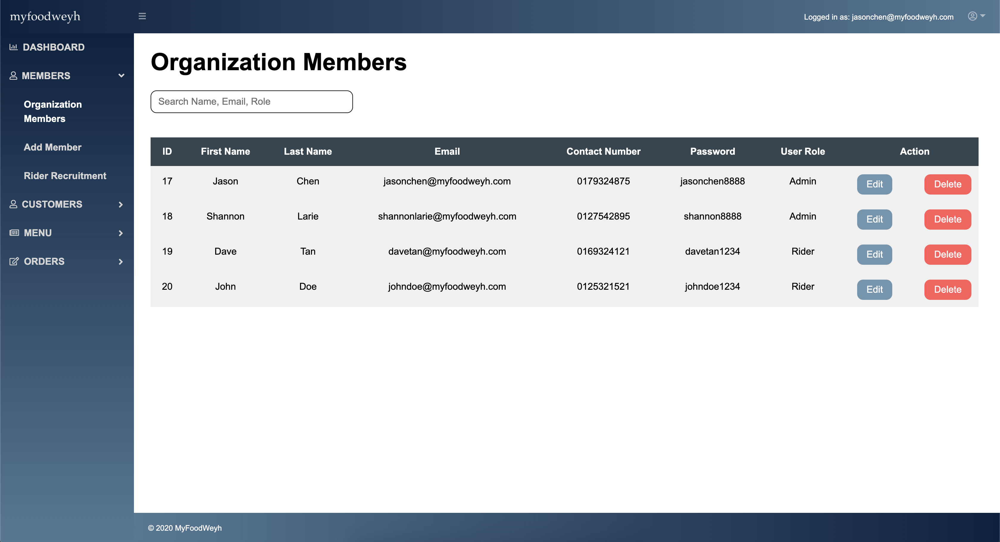

#### Rider Recruitment
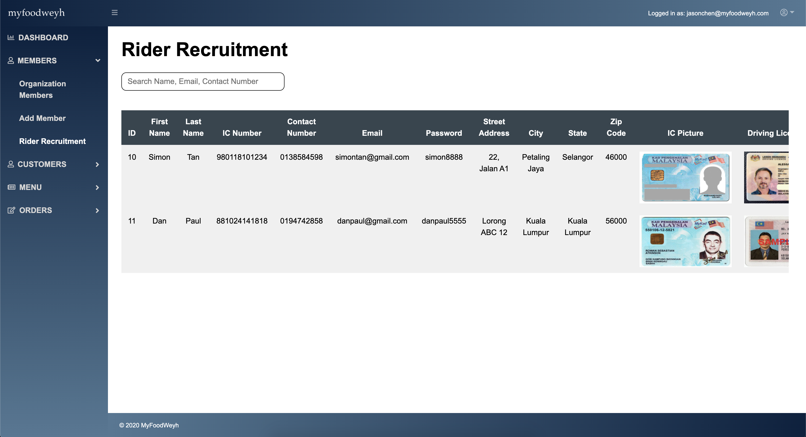

#### Manage Customer Account
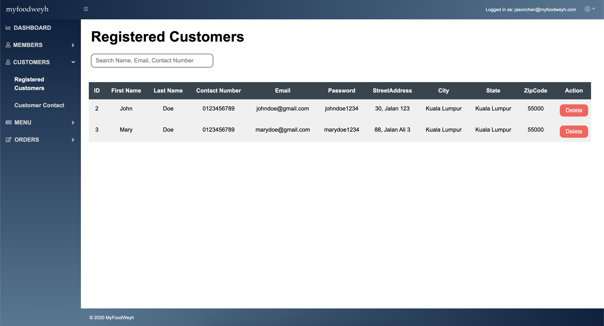

#### Manage Food Menu
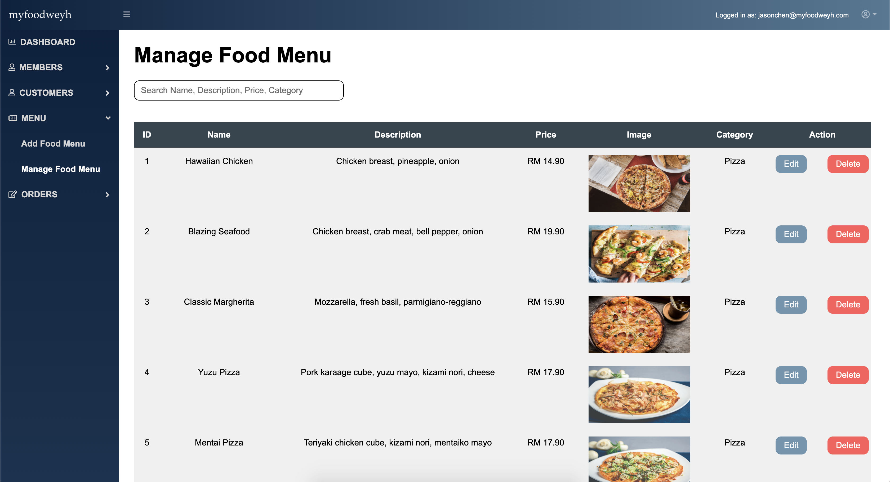

#### New Orders
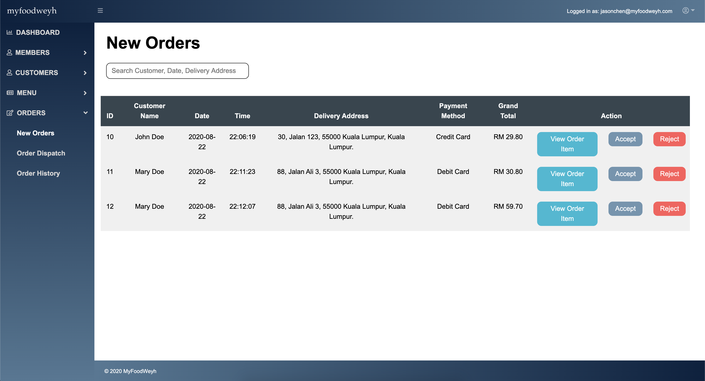

 

### Customer
#### Sign Up
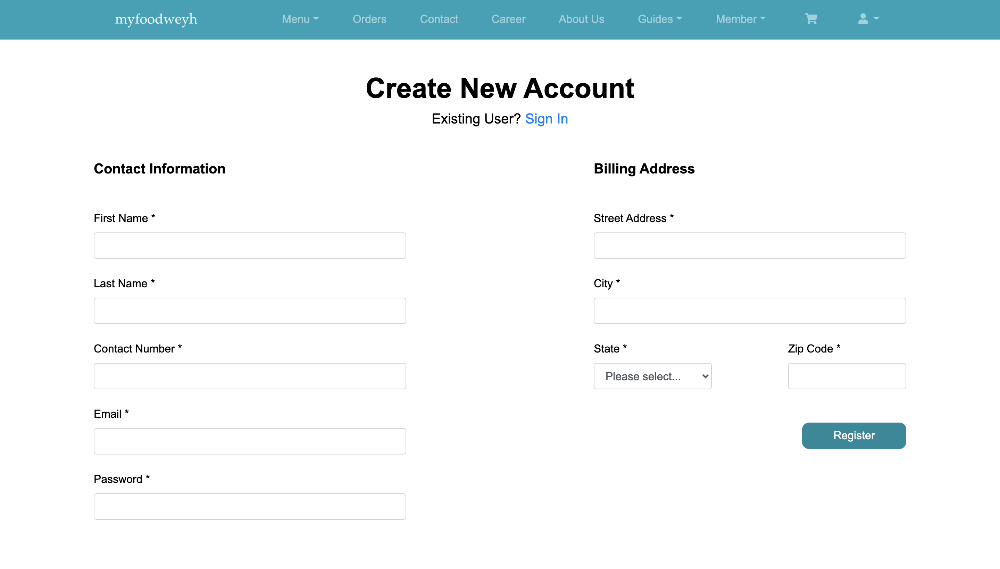

#### Homepage

#### Food Menu
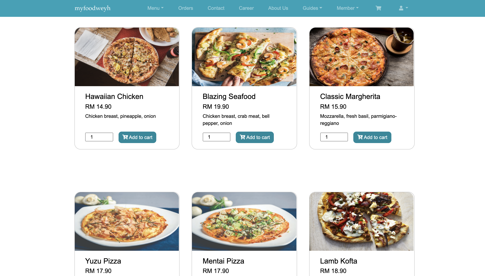

#### Contact
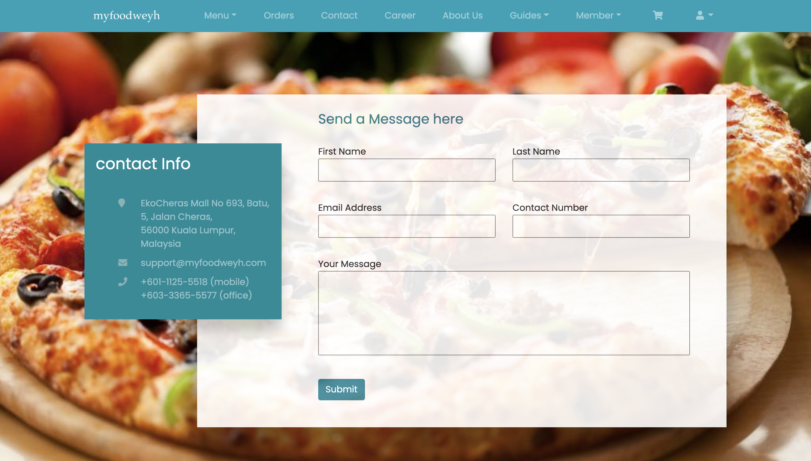

#### FAQ
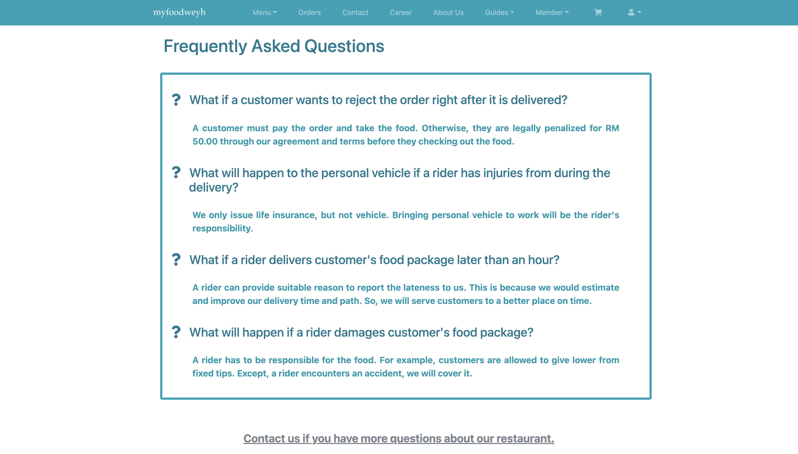

#### Shopping Cart
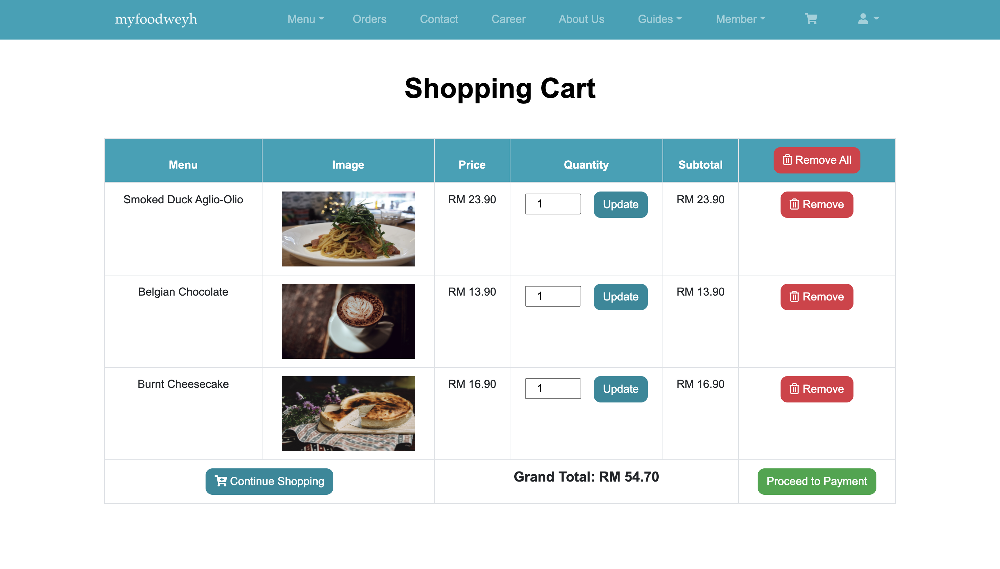

#### Orders
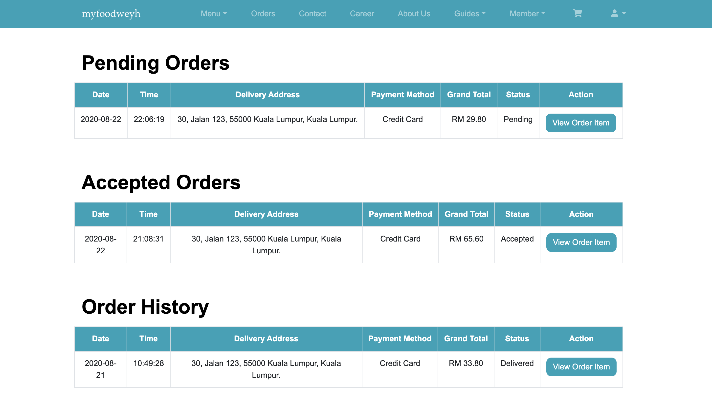

 

### Rider
#### Rider Registration

#### On Going Order
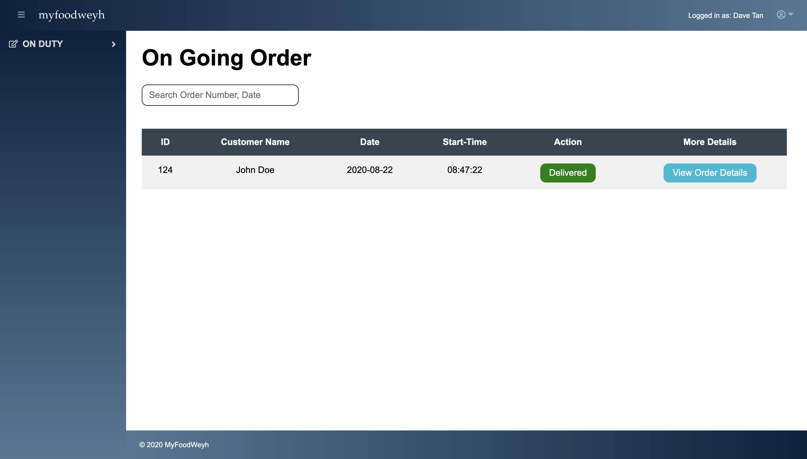
